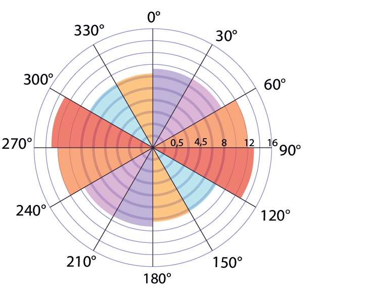

# Кампусы России

```{=html}
<div style="position: relative; width: 100%; height: 85vh; min-height: 600px;">
  
  <div id="landing-map" style="width: 100%; height: 100%; background-color: #cbd5e1;"></div>

  <div id="theme-switcher" style="position: absolute; top: 10px; left: 10px; background-color: rgba(255, 255, 255, 0.95); padding: 12px 16px; border-radius: 6px; box-shadow: 0 2px 6px rgba(0,0,0,0.15); z-index: 10; font-family: 'Noto Sans', sans-serif; font-size: 13px; color: #1e293b; display: none; width: 250px;">
    <div style="font-weight: bold; font-size: 13px; margin-bottom: 10px; border-bottom: 1px solid #cbd5e1; padding-bottom: 6px;">
      Тематика карты
    </div>
    <label style="display: flex; align-items: center; margin-bottom: 8px; cursor: pointer;">
      <input type="radio" name="map-theme" value="theme1" checked style="accent-color: #F553A0; margin-right: 8px; cursor: pointer;">
      Пространственная структура
    </label>
    <label style="display: flex; align-items: center; margin-bottom: 8px; cursor: pointer;">
      <input type="radio" name="map-theme" value="theme2" style="accent-color: #F553A0; margin-right: 8px; cursor: pointer;">
      Функциональные типы
    </label>
    <label style="display: flex; align-items: center; cursor: pointer;">
      <input type="radio" name="map-theme" value="theme3" style="accent-color: #F553A0; margin-right: 8px; cursor: pointer;">
      Инфраструктура
    </label>
  </div>

  <div style="position: absolute; top: 10px; right: 50px; background-color: rgba(255, 255, 255, 0.95); padding: 14px 18px; border-radius: 6px; box-shadow: 0 2px 6px rgba(0,0,0,0.15); z-index: 10; font-family: 'Noto Sans', sans-serif; font-size: 13px; color: #1e293b; width: 330px; max-height: 80vh; overflow-y: auto;">
    
    <div id="legend-regions">
      <table style="border: none; margin: 0; padding: 0; background: transparent;">
        <tr style="background: transparent;">
          <td style="padding: 0 12px 10px 0; border: none; vertical-align: middle; text-align: center;">
            <div style="width: 22px; height: 22px; border-radius: 50%; background-color: #F553A0; border: 2px solid #ffffff; box-shadow: 0 0 3px rgba(0,0,0,0.3); text-align: center; line-height: 18px; color: #ffffff; font-weight: bold; font-size: 11px; margin: 0 auto;">6</div>
          </td>
          <td style="padding: 0 0 10px 0; border: none; vertical-align: middle; line-height: 1.3;">
            Количество университетских кампусов<br>(по субъектам)
          </td>
        </tr>
        <tr style="background: transparent;">
          <td style="padding: 0 12px 10px 0; border: none; vertical-align: middle; text-align: center;">
            <div style="width: 20px; height: 14px; background-color: #ffebed; border: 1px solid #f4c2c9; border-radius: 2px; margin: 0 auto;"></div>
          </td>
          <td style="padding: 0 0 10px 0; border: none; vertical-align: middle; line-height: 1.3;">Субъекты РФ</td>
        </tr>
        <tr style="background: transparent;">
          <td style="padding: 0 12px 0 0; border: none; vertical-align: middle; text-align: center;">
            <div style="width: 20px; height: 14px; background-color: #e2e8f0; border: 1px solid #cbd5e1; border-radius: 2px; margin: 0 auto;"></div>
          </td>
          <td style="padding: 0; border: none; vertical-align: middle; line-height: 1.3; color: #64748b; font-size: 12px;">Актуальные данные отсутствуют</td>
        </tr>
      </table>
    </div>
    
    <div id="legend-campuses" style="display: none;">
      
      <div id="theme1-legend">
        <table style="border: none; margin: 0; padding: 0; background: transparent;">
          <tr style="background: transparent;">
            <td colspan="2" style="padding: 0 0 8px 0; border: none; font-weight: bold; font-size: 12px; color: #1e293b;">Пространственный тип кампуса</td>
          </tr>
          <tr style="background: transparent;">
            <td style="padding: 0 12px 4px 0; border: none; vertical-align: middle; text-align: center;">
              <div style="width: 14px; height: 14px; border-radius: 50%; background-color: #ff99ff; border: 1.5px solid #ffffff; box-shadow: 0 0 2px rgba(0,0,0,0.3); margin: 0 auto;"></div>
            </td>
            <td style="padding: 0 0 4px 0; border: none; vertical-align: middle; font-size: 12px;">Городской локальный</td>
          </tr>
          <tr style="background: transparent;">
            <td style="padding: 0 12px 4px 0; border: none; vertical-align: middle; text-align: center;">
              <div style="width: 14px; height: 14px; border-radius: 50%; background-color: #99bbff; border: 1.5px solid #ffffff; box-shadow: 0 0 2px rgba(0,0,0,0.3); margin: 0 auto;"></div>
            </td>
            <td style="padding: 0 0 4px 0; border: none; vertical-align: middle; font-size: 12px;">Городской распределенный</td>
          </tr>
          <tr style="background: transparent;">
            <td style="padding: 0 12px 4px 0; border: none; vertical-align: middle; text-align: center;">
              <div style="width: 14px; height: 14px; border-radius: 50%; background-color: #adebad; border: 1.5px solid #ffffff; box-shadow: 0 0 2px rgba(0,0,0,0.3); margin: 0 auto;"></div>
            </td>
            <td style="padding: 0 0 4px 0; border: none; vertical-align: middle; font-size: 12px;">Загородный</td>
          </tr>
          <tr style="background: transparent;">
            <td style="padding: 0 12px 4px 0; border: none; vertical-align: middle; text-align: center;">
              <div style="width: 14px; height: 14px; border-radius: 50%; background-color: #99ffff; border: 1.5px solid #ffffff; box-shadow: 0 0 2px rgba(0,0,0,0.3); margin: 0 auto;"></div>
            </td>
            <td style="padding: 0 0 4px 0; border: none; vertical-align: middle; font-size: 12px;">Кампус инновационного центра</td>
          </tr>
          <tr style="background: transparent;">
            <td style="padding: 10px 12px 16px 0; border: none; vertical-align: middle; text-align: center;">
              <div style="position: relative; width: 14px; height: 14px; border-radius: 50%; background-color: #ff99ff; background-image: repeating-linear-gradient(45deg, transparent, transparent 2px, rgba(100,116,139,0.3) 2px, rgba(100,116,139,0.3) 4px); border: 1.5px solid #ffffff; box-shadow: 0 0 2px rgba(0,0,0,0.3); margin: 0 auto;">
                <div style="position: absolute; top: 50%; left: 50%; transform: translate(-50%, -50%); width: 4px; height: 4px; border-radius: 50%; background-color: #64748b;"></div>
              </div>
            </td>
            <td style="padding: 10px 0 16px 0; border: none; vertical-align: middle; line-height: 1.2;">
              <span style="font-size: 12px; color: #475569;">Строящийся кампус</span><br>
              <span style="font-size: 10px; color: #94a3b8;">(На примере локального)</span>
            </td>
          </tr>
<tr style="background: transparent;">
  <td colspan="2" style="padding: 10px 0 6px 0; border: none; font-weight: bold; font-size: 12px; color: #1e293b; line-height: 1.2;">
    Пространственные паттерны ведомственных кампусов<br>
    <span style="font-size: 10px; font-weight: normal; color: #64748b;"></span>
  </td>
</tr>
<tr style="background: transparent;">
  <td style="width: 35px; padding: 0 12px 4px 0; border: none; vertical-align: middle; text-align: center;">
    <div style="position: relative; width: 22px; height: 22px; border-radius: 50%; border: 2.0px solid #45150A; margin: 0 auto; display: block;">
      <div style="position: absolute; top: 50%; left: 50%; transform: translate(-50%, -50%); width: 13px; height: 13px; border-radius: 50%; background-color: #cbd5e1; border: 1.5px solid #ffffff;"></div>
    </div>
  </td>
  <td style="padding: 0 0 4px 0; border: none; vertical-align: middle; line-height: 1.1;">
    <span style="font-size: 12px;">Военные ВУЗы (Минобороны, МВД, ФСБ)</span><br>
    <span style="font-size: 10px; color: #64748b;">Режимные территории</span>
  </td>
</tr>
<tr style="background: transparent;">
  <td style="width: 35px; padding: 0 12px 4px 0; border: none; vertical-align: middle; text-align: center;">
    <div style="position: relative; width: 22px; height: 22px; border-radius: 50%; border: 2.0px solid #22C55E; margin: 0 auto; display: block;">
      <div style="position: absolute; top: 50%; left: 50%; transform: translate(-50%, -50%); width: 13px; height: 13px; border-radius: 50%; background-color: #cbd5e1; border: 1.5px solid #ffffff;"></div>
    </div>
  </td>
  <td style="padding: 0 0 4px 0; border: none; vertical-align: middle; line-height: 1.1;">
    <span style="font-size: 12px;">Аграрные ВУЗы (Минсельхоз)</span><br>
    <span style="font-size: 10px; color: #64748b;">Наличие обширных земельных угодий</span>
  </td>
</tr>
<tr style="background: transparent;">
  <td style="width: 35px; padding: 0 12px 6px 0; border: none; vertical-align: middle; text-align: center;">
    <div style="position: relative; width: 22px; height: 22px; border-radius: 50%; border: 2.0px solid #DC11ED; margin: 0 auto; display: block;">
      <div style="position: absolute; top: 50%; left: 50%; transform: translate(-50%, -50%); width: 13px; height: 13px; border-radius: 50%; background-color: #cbd5e1; border: 1.5px solid #ffffff;"></div>
    </div>
  </td>
  <td style="padding: 0 0 6px 0; border: none; vertical-align: middle; line-height: 1.1;">
    <span style="font-size: 12px;">Медицинские ВУЗы (Минздрав)</span><br>
    <span style="font-size: 10px; color: #64748b;">Наличие производственно-практической инфраструктуры (клиник и больниц)</span>
  </td>
</tr>
<tr style="background: transparent;">
  <td style="width: 35px; padding: 0 12px 10px 0; border: none; vertical-align: middle; text-align: center;">
    <div style="position: relative; width: 22px; height: 22px; border-radius: 50%; border: 2.0px solid transparent; margin: 0 auto; display: block;">
      <div style="position: absolute; top: 50%; left: 50%; transform: translate(-50%, -50%); width: 13px; height: 13px; border-radius: 50%; background-color: #cbd5e1; border: 1.5px solid #ffffff;"></div>
    </div>
  </td>
  <td style="padding: 0 0 10px 0; border: none; vertical-align: middle; line-height: 1.1;">
    <span style="font-size: 12px;">Прочие ВУЗы (Минобрнауки и др.)</span><br>
    <span style="font-size: 10px; color: #64748b;">Стандартная городская инфраструктура</span>
  </td>
</tr>
          <tr style="background: transparent;">
            <td colspan="2" style="padding: 8px 0 4px 0; border: none; font-weight: bold; font-size: 12px; color: #1e293b; line-height: 1.2;">
              Площадь кампуса
            </td>
          </tr>
          <tr style="background: transparent;">
            <td colspan="2" style="padding: 0 0 10px 10px; border: none;">
              <div style="position: relative; height: 42px; width: 100%; margin-top: 2px;">
                <div style="position: absolute; bottom: 5px; left: 20px; transform: translateX(-50%); width: 27px; height: 27px; border-radius: 50%; border: 1px solid #64748b; background-color: rgba(203, 213, 225, 0.4);"></div>
                <div style="position: absolute; bottom: 5px; left: 20px; transform: translateX(-50%); width: 19px; height: 19px; border-radius: 50%; border: 1px solid #64748b; background-color: rgba(203, 213, 225, 0.4);"></div>
                <div style="position: absolute; bottom: 5px; left: 20px; transform: translateX(-50%); width: 13px; height: 13px; border-radius: 50%; border: 1px solid #64748b; background-color: rgba(203, 213, 225, 0.4);"></div>
                <svg width="40" height="42" style="position: absolute; bottom: 5px; left: 20px; overflow: visible;">
                  <line x1="0" y1="26" x2="28" y2="26" stroke="#94a3b8" stroke-width="1" stroke-dasharray="2,2"/>
                  <line x1="0" y1="18" x2="28" y2="18" stroke="#94a3b8" stroke-width="1" stroke-dasharray="2,2"/>
                  <line x1="0" y1="10" x2="28" y2="10" stroke="#94a3b8" stroke-width="1" stroke-dasharray="2,2"/>
                </svg>
                <div style="position: absolute; bottom: 32px; left: 52px; font-size: 11px; color: #1e293b; line-height: 1;">более 50 га</div>
                <div style="position: absolute; bottom: 15px; left: 52px; font-size: 11px; color: #1e293b; line-height: 1;">15–50 га</div>
                <div style="position: absolute; bottom: -2px; left: 52px; font-size: 11px; color: #1e293b; line-height: 1;">менее 15 га</div>
              </div>
            </td>
          </tr>
          <tr style="background: transparent;">
            <td style="padding: 0 12px 0 0; border: none; vertical-align: middle; text-align: center;">
              <div style="width: 14px; height: 14px; background-color: #cbd5e1; border: 1px solid #94a3b8; border-radius: 2px; margin: 0 auto;"></div>
            </td>
            <td style="padding: 0; border: none; vertical-align: middle; font-size: 12px;">Территория кампуса</td>
          </tr>
        </table>
      </div>

      <div id="theme2-legend" style="display: none;">
        <table style="border: none; margin: 0; padding: 0; background: transparent;">
          <tr style="background: transparent;">
            <td colspan="2" style="padding: 0 0 10px 0; border: none; font-weight: bold; font-size: 12px; color: #1e293b;">
              Функции кампуса
            </td>
          </tr>
          <tr style="background: transparent;">
            <td style="padding: 0 12px 6px 0; border: none; text-align: center;"><div id="leg-col-uch" style="width: 14px; height: 14px; border-radius: 2px; margin: 0 auto;"></div></td>
            <td style="padding: 0 0 6px 0; border: none; font-size: 12px;">Учебная</td>
          </tr>
          <tr style="background: transparent;">
            <td style="padding: 0 12px 6px 0; border: none; text-align: center;"><div id="leg-col-zilaya" style="width: 14px; height: 14px; border-radius: 2px; margin: 0 auto;"></div></td>
            <td style="padding: 0 0 6px 0; border: none; font-size: 12px;">Жилая</td>
          </tr>
          <tr style="background: transparent;">
            <td style="padding: 0 12px 6px 0; border: none; text-align: center;"><div id="leg-col-nauch_labb" style="width: 14px; height: 14px; border-radius: 2px; margin: 0 auto;"></div></td>
            <td style="padding: 0 0 6px 0; border: none; font-size: 12px;">Научно-исследовательская</td>
          </tr>
          <tr style="background: transparent;">
            <td style="padding: 0 12px 6px 0; border: none; text-align: center;"><div id="leg-col-sportt" style="width: 14px; height: 14px; border-radius: 2px; margin: 0 auto;"></div></td>
            <td style="padding: 0 0 6px 0; border: none; font-size: 12px;">Спортивная</td>
          </tr>
          <tr style="background: transparent;">
            <td style="padding: 0 12px 6px 0; border: none; text-align: center;"><div id="leg-col-greeen" style="width: 14px; height: 14px; border-radius: 2px; margin: 0 auto;"></div></td>
            <td style="padding: 0 0 6px 0; border: none; font-size: 12px;">Рекреационная</td>
          </tr>
          <tr style="background: transparent;">
            <td style="padding: 0 12px 6px 0; border: none; text-align: center;"><div id="leg-col-meed" style="width: 14px; height: 14px; border-radius: 2px; margin: 0 auto;"></div></td>
            <td style="padding: 0 0 6px 0; border: none; font-size: 12px;">Медицинская</td>
          </tr>
          <tr style="background: transparent;">
            <td style="padding: 0 12px 6px 0; border: none; text-align: center;"><div id="leg-col-proizvod" style="width: 14px; height: 14px; border-radius: 2px; margin: 0 auto;"></div></td>
            <td style="padding: 0 0 6px 0; border: none; font-size: 12px;">Производственно-практическая</td>
          </tr>
          <tr style="background: transparent;">
            <td style="padding: 0 12px 10px 0; border: none; text-align: center;"><div id="leg-col-cultur" style="width: 14px; height: 14px; border-radius: 2px; margin: 0 auto;"></div></td>
            <td style="padding: 0 0 10px 0; border: none; font-size: 12px;">Общественно-культурная</td>
          </tr>
          <tr style="background: transparent;">
            <td colspan="2" style="padding: 10px 0 8px 0; border: none; font-weight: bold; font-size: 12px; color: #1e293b; border-top: 1px solid #cbd5e1;">
              Уровень развития инфраструктуры
            </td>
          </tr>
          <tr style="background: transparent;">
            <td colspan="2" style="padding: 0 0 10px 10px; border: none;">
              <div style="position: relative; height: 35px; width: 100%; margin-top: 2px;">
                <div style="position: absolute; bottom: 5px; left: 20px; transform: translateX(-50%); width: 26px; height: 26px; border-radius: 50%; border: 1px solid #64748b; background-color: rgba(203, 213, 225, 0.4);"></div>
                <div style="position: absolute; bottom: 5px; left: 20px; transform: translateX(-50%); width: 20px; height: 20px; border-radius: 50%; border: 1px solid #64748b; background-color: rgba(203, 213, 225, 0.4);"></div>
                <div style="position: absolute; bottom: 5px; left: 20px; transform: translateX(-50%); width: 14px; height: 14px; border-radius: 50%; border: 1px solid #64748b; background-color: rgba(203, 213, 225, 0.4);"></div>
                <svg width="40" height="42" style="position: absolute; bottom: 5px; left: 20px; overflow: visible;">
                  <line x1="0" y1="27" x2="28" y2="27" stroke="#94a3b8" stroke-width="1" stroke-dasharray="2,2"/>
                  <line x1="0" y1="20" x2="28" y2="20" stroke="#94a3b8" stroke-width="1" stroke-dasharray="2,2"/>
                  <line x1="0" y1="14" x2="28" y2="14" stroke="#94a3b8" stroke-width="1" stroke-dasharray="2,2"/>
                </svg>
                <div style="position: absolute; bottom: 25px; left: 52px; font-size: 11px; color: #1e293b; line-height: 1;">Комплексная (7–8)</div>
                <div style="position: absolute; bottom: 13px; left: 52px; font-size: 11px; color: #1e293b; line-height: 1;">Развитая (4–6)</div>
                <div style="position: absolute; bottom: 0px; left: 52px; font-size: 11px; color: #1e293b; line-height: 1;">Базовая (2–3)</div>
              </div>
            </td>
          </tr>
        </table>
      </div>

      <div id="theme3-legend" style="display: none;">
        <table style="border: none; margin: 0; padding: 0; background: transparent; width: 100%;">
          
          <tr style="background: transparent;">
            <td colspan="2" style="padding: 0 0 10px 0; border: none; font-weight: bold; font-size: 12px; color: #1e293b;">
              Общее число студентов, обучающихся очно
            </td>
          </tr>
          <tr style="background: transparent;">
            <td colspan="2" style="padding: 0 0 15px 10px; border: none;">
              <div style="position: relative; height: 45px; width: 100%; margin-top: 2px;">
                <div style="position: absolute; bottom: 5px; left: 20px; transform: translateX(-50%); width: 36px; height: 36px; border-radius: 50%; border: 1px solid #64748b; background-color: rgba(203, 213, 225, 0.4);"></div>
                <div style="position: absolute; bottom: 5px; left: 20px; transform: translateX(-50%); width: 26px; height: 26px; border-radius: 50%; border: 1px solid #64748b; background-color: rgba(203, 213, 225, 0.4);"></div>
                <div style="position: absolute; bottom: 5px; left: 20px; transform: translateX(-50%); width: 18px; height: 18px; border-radius: 50%; border: 1px solid #64748b; background-color: rgba(203, 213, 225, 0.4);"></div>
                <svg width="40" height="50" style="position: absolute; bottom: 5px; left: 20px; overflow: visible;">
                  <line x1="0" y1="36" x2="30" y2="36" stroke="#94a3b8" stroke-width="1" stroke-dasharray="2,2"/>
                  <line x1="0" y1="23" x2="30" y2="23" stroke="#94a3b8" stroke-width="1" stroke-dasharray="2,2"/>
                  <line x1="0" y1="14" x2="30" y2="14" stroke="#94a3b8" stroke-width="1" stroke-dasharray="2,2"/>
                </svg>
                <div style="position: absolute; bottom: 35px; left: 54px; font-size: 11px; color: #1e293b; line-height: 1; white-space: nowrap;">> 15 000</div>
                <div style="position: absolute; bottom: 18px; left: 54px; font-size: 11px; color: #1e293b; line-height: 1; white-space: nowrap;">5 000–15 000</div>
                <div style="position: absolute; bottom: 1px; left: 54px; font-size: 11px; color: #1e293b; line-height: 1; white-space: nowrap;">< 5 000</div>
              </div>
            </td>
          </tr>

          <tr style="background: transparent;">
            <td colspan="2" style="padding: 10px 0 8px 0; border: none; font-weight: bold; font-size: 12px; color: #1e293b; border-top: 1px solid #cbd5e1;">
              Состав обучающихся
            </td>
          </tr>
          <tr style="background: transparent;">
            <td colspan="2" style="padding: 0; border: none;">
              <div style="position: relative; height: 90px; width: 100%;">
                <div style="position: absolute; top: 33px; left: 10px; width: 24px; height: 24px; border-radius: 50%; background: #cbd5e1; box-shadow: 0 0 3px rgba(0,0,0,0.4);">
                   <div style="position: absolute; top: 15%; left: 15%; width: 70%; height: 70%; border-radius: 50%; background: conic-gradient(#82EDDC 0% 30%, #FF7AF3 30% 100%); border: 1.5px solid #fff;"></div>
                </div>
                <svg width="300" height="90" style="position: absolute; top: 0; left: 0; pointer-events: none;">
                   <defs>
                     <marker id="arr-stud" markerWidth="5" markerHeight="4" refX="4" refY="2" orient="auto">
                       <polygon points="0 0, 5 2, 0 4" fill="#94a3b8" />
                     </marker>
                   </defs>
                   <polyline points="45,15 26,15 26,38" fill="none" stroke="#94a3b8" stroke-width="1" marker-end="url(#arr-stud)"/>
                   <polyline points="45,75 18,75 18,52" fill="none" stroke="#94a3b8" stroke-width="1" marker-end="url(#arr-stud)"/>
                </svg>
                <div style="position: absolute; top: 10px; left: 50px; font-size: 11px; line-height: 1.2; width: 240px; color: #1e293b;">Доля иностранных студентов</div>
                <div style="position: absolute; top: 70px; left: 50px; font-size: 11px; line-height: 1.2; width: 240px; color: #1e293b;">Доля студентов РФ</div>
              </div>
            </td>
          </tr>

          <tr style="background: transparent;">
            <td colspan="2" style="padding: 10px 0 8px 0; border: none; font-weight: bold; font-size: 12px; color: #1e293b; border-top: 1px solid #cbd5e1;">
              Жилой фонд
            </td>
          </tr>
          <tr style="background: transparent;">
            <td colspan="2" style="padding: 0; border: none;">
              <div style="position: relative; height: 90px; width: 100%;">
                <div style="position: absolute; top: 33px; left: 10px; width: 24px; height: 24px; border-radius: 50%; background: conic-gradient(#6FCF61 0% 50%, #FF6154 50% 100%); box-shadow: 0 0 3px rgba(0,0,0,0.4);">
                   <div style="position: absolute; top: 15%; left: 15%; width: 70%; height: 70%; border-radius: 50%; background: #e2e8f0; border: 1.5px solid #fff;"></div>
                </div>
                <svg width="300" height="90" style="position: absolute; top: 0; left: 0; pointer-events: none;">
                   <defs>
                     <marker id="arr-dorm" markerWidth="5" markerHeight="4" refX="4" refY="2" orient="auto">
                       <polygon points="0 0, 5 2, 0 4" fill="#94a3b8" />
                     </marker>
                   </defs>
                   <polyline points="45,15 31,15 31,41" fill="none" stroke="#94a3b8" stroke-width="1" marker-end="url(#arr-dorm)"/>
                   <polyline points="45,75 13,75 13,49" fill="none" stroke="#94a3b8" stroke-width="1" marker-end="url(#arr-dorm)"/>
                </svg>
                <div style="position: absolute; top: 9px; left: 50px; font-size: 11px; line-height: 1.2; width: 240px; color: #1e293b;">Доля койко-мест<br>на территории кампуса</div>
                <div style="position: absolute; top: 69px; left: 50px; font-size: 11px; line-height: 1.2; width: 240px; color: #1e293b;">Доля койко-мест<br>за территорией кампуса</div>
              </div>
            </td>
          </tr>
          
        </table>
      </div>

      <div id="timeline-container" style="margin-top: 15px; padding-top: 12px; border-top: 1px solid #cbd5e1;">
        <div style="font-weight: bold; font-size: 12px; color: #1e293b; line-height: 1.2; margin-bottom: 8px;">
          Время ввода в эксплуатацию<br>зданий кампуса
        </div>
        <div style="text-align: center; margin-bottom: 4px;">
          <span id="year-display" style="font-weight: 800; color: #F553A0; font-size: 22px;">2026 г.</span>
        </div>
        <input type="range" id="year-slider" min="1797" max="2026" value="2026" step="1" style="width: 100%; cursor: pointer; accent-color: #F553A0;">
      </div>

    </div>

  </div>

</div>

<script>
  const functionColors = { uch: '#F2295B', zilaya: '#FFAB59', nauch_labb: '#83E6E6', sportt: '#B81818', greeen: '#74D67B', meed: '#9B64E8', proizvod: '#7EAFED', cultur: '#DC43E8' };

  document.addEventListener("DOMContentLoaded", () => {
    for (let key in functionColors) {
      let el = document.getElementById('leg-col-' + key);
      if(el) el.style.backgroundColor = functionColors[key];
    }
  });

  function startSafeMap() {
    
    const theme1ColorMap = ["match", ["get", "tipolog"], "loc", "#ff99ff", "rasp", "#99bbff", "zagor", "#adebad", "nauk", "#99ffff", "#94a3b8"];

    const inlineStyle = {
      "version": 8, "projection": { "type": "globe" }, "glyphs": "https://demotiles.maplibre.org/font/{fontstack}/{range}.pbf",
      "sources": {
        "carto-positron": { "type": "raster", "tiles": ["https://basemaps.cartocdn.com/light_all/{z}/{x}/{y}.png"], "tileSize": 256 },
        "russia-shape": { "type": "geojson", "data": "russia_updated.geojson", "generateId": true },
        "russia-centroids": { "type": "geojson", "data": "centroids.geojson" },
        "rf-total-source": { "type": "geojson", "data": { "type": "FeatureCollection", "features": [{ "type": "Feature", "geometry": { "type": "Point", "coordinates": [95, 62] }, "properties": { "total_num": "158", "total_desc": "Всего университетских\nкампусов в РФ" } }] } },
        "campuses-source": { "type": "geojson", "data": "campuses_updated.geojson" },
        "pol-camp-source": { "type": "geojson", "data": "pol_camp.geojson" },
        "campus-buildings-source": { "type": "geojson", "data": "campus_buildings.geojson" }
      },
      "layers": [
        { "id": "base-layer", "type": "raster", "source": "carto-positron" },
        { "id": "r-fill", "type": "fill", "source": "russia-shape", "paint": { "fill-color": ["case", ["boolean", ["feature-state", "hover"], false], ["match", ["get", "region"], ["Запорожская область", "Херсонская область", "Донецкая народная республика", "Луганская народная республика"], "#cbd5e1", "#f4c2c9"], ["match", ["get", "region"], ["Запорожская область", "Херсонская область", "Донецкая народная республика", "Луганская народная республика"], "#e2e8f0", "#ffebed"] ], "fill-opacity": 0.8 } },
        { "id": "r-line", "type": "line", "source": "russia-shape", "paint": { "line-color": "#000000", "line-width": 0.6, "line-opacity": 0.8 } },
        { "id": "rf-total-circle", "type": "circle", "source": "rf-total-source", "maxzoom": 2.5, "paint": { "circle-radius": 20, "circle-color": "#F553A0", "circle-stroke-color": "#ffffff", "circle-stroke-width": 3 } },
        { "id": "rf-total-num", "type": "symbol", "source": "rf-total-source", "maxzoom": 2.5, "layout": { "text-field": ["get", "total_num"], "text-font": ["Noto Sans Bold"], "text-size": 16, "text-anchor": "center" }, "paint": { "text-color": "#ffffff" } },
        { "id": "rf-total-desc", "type": "symbol", "source": "rf-total-source", "maxzoom": 2.5, "layout": { "text-field": ["get", "total_desc"], "text-font": ["Noto Sans Bold"], "text-size": 16, "text-offset": [0, 3.2], "text-anchor": "top", "text-justify": "center" }, "paint": { "text-color": "#1e293b", "text-halo-color": "#ffffff", "text-halo-width": 2 } },
        { "id": "subject-badge-circles", "type": "circle", "source": "russia-centroids", "filter": [">", ["get", "NUMPOINTS"], 0], "minzoom": 2.3, "maxzoom": 4.0, "paint": { "circle-radius": 10, "circle-color": "#F553A0", "circle-stroke-color": "#ffffff", "circle-stroke-width": 2 } },
        { "id": "subject-badge-labels", "type": "symbol", "source": "russia-centroids", "filter": [">", ["get", "NUMPOINTS"], 0], "minzoom": 2.3, "maxzoom": 4.0, "layout": { "text-field": "{NUMPOINTS}", "text-font": ["Noto Sans Bold"], "text-size": 8.5, "text-anchor": "center" }, "paint": { "text-color": "#ffffff" } },
        { "id": "campuses-polygons-fill", "type": "fill", "source": "pol-camp-source", "minzoom": 8.0, "paint": { "fill-color": "#b3b3cc", "fill-opacity": 0.5 } },
        { "id": "campuses-polygons-highlight", "type": "fill", "source": "pol-camp-source", "minzoom": 8.0, "filter": ["==", "name", ""], "paint": { "fill-color": "#FBBF24", "fill-opacity": 0.7 } },
        { "id": "campuses-polygons-line", "type": "line", "source": "pol-camp-source", "minzoom": 8.0, "paint": { "line-color": "#111827", "line-width": 0.7 } },
        { "id": "campus-buildings-3d", "type": "fill-extrusion", "source": "campus-buildings-source", "minzoom": 11.3, "paint": { "fill-extrusion-color": "#4A3A35", "fill-extrusion-height": 15, "fill-extrusion-opacity": 0.85 } },
        { "id": "campuses-rings", "type": "circle", "source": "campuses-source", "minzoom": 4.0, "layout": { "circle-sort-key": ["*", -1, ["to-number", ["get", "ar"]]] }, "paint": { "circle-radius": ["step", ["to-number", ["get", "ar"]], 8, 150000, 11, 500000, 16], "circle-color": "transparent", "circle-stroke-width": 1.5, "circle-stroke-color": ["match", ["get", "vedomst"], "v", "#45150A", "a", "#22C55E", "m", "#DC11ED", "transparent"] } },
        { "id": "campuses-points", "type": "circle", "source": "campuses-source", "minzoom": 4.0, "layout": { "circle-sort-key": ["*", -1, ["to-number", ["get", "ar"]]] }, "paint": { "circle-radius": ["step", ["to-number", ["get", "ar"]], 5, 150000, 8, 500000, 12], "circle-color": theme1ColorMap, "circle-stroke-color": "#ffffff", "circle-stroke-width": 1.5 } },
        { "id": "campuses-points-construction", "type": "circle", "source": "campuses-source", "minzoom": 4.0, "filter": ["any", ["==", ["get", "type_campu"], "строится"], ["==", ["get", "type_campu"], "Строится"]], "paint": { "circle-radius": ["step", ["to-number", ["get", "ar"]], 2, 150000, 3.5, 500000, 5], "circle-color": "#475569" } }
      ]
    };

    const map = new maplibregl.Map({ container: 'landing-map', style: inlineStyle, center: [95, 62], zoom: 2.6, hash: false });
    const popup = new maplibregl.Popup({ closeButton: false, closeOnClick: false, offset: 10 });

    let pieMarkers = [];
    let peopleMarkers = [];
    
    function fmt(num) { return num ? num.toString().replace(/\B(?=(\d{3})+(?!\d))/g, " ") : "0"; }
    function displayVal(val) { return val < 0 ? "Нет данных" : fmt(val); }

    function safeParse(val) {
      if (val === null || val === undefined) return 0;
      const str = String(val).replace(/[\s,]/g, '');
      const parsed = parseInt(str, 10);
      return isNaN(parsed) ? 0 : parsed;
    }
    
    fetch('campuses_updated.geojson').then(res => res.json()).then(data => {
        
        //ДАННЫЕ ДЛЯ ТЕМЫ 2
        let featuresTheme2 = [...data.features].sort((a, b) => safeParse(b.properties.fun_type) - safeParse(a.properties.fun_type));
        featuresTheme2.forEach(feature => {
          const props = feature.properties;
          const activeFuncs = Object.keys(functionColors).filter(key => { const val = props[key]; return val !== null && val !== undefined && val !== "" && String(val).toUpperCase() !== "NULL"; });
          if(activeFuncs.length === 0) return;

          let size = 14; const ft = safeParse(props.fun_type);
          if(ft === 2) size = 20; else if(ft === 3) size = 26; 

          const step = 100 / activeFuncs.length;
          const gradientParts = activeFuncs.map((f, i) => `${functionColors[f]} ${i * step}% ${(i + 1) * step}%`);
          
          const el = document.createElement('div');
          el.style.width = size + 'px'; el.style.height = size + 'px';
          el.style.borderRadius = '50%'; el.style.background = `conic-gradient(${gradientParts.join(', ')})`;
          el.style.border = '1.5px solid #ffffff'; el.style.boxShadow = '0 0 3px rgba(0,0,0,0.5)';
          el.style.cursor = 'pointer'; el.style.display = 'none';

          el.addEventListener('mouseenter', () => {
            popup.setLngLat(feature.geometry.coordinates).setHTML(`<div style="font-size: 11px; color: #64748b; margin-bottom: 2px;">Университет</div><strong>${props.name || "Кампус"}</strong><br><span style="font-size: 10px; color: #F553A0; font-weight: bold;">Функций: ${activeFuncs.length}</span>`).addTo(map);
          });
          el.addEventListener('mouseleave', () => popup.remove());
          pieMarkers.push(new maplibregl.Marker({ element: el, anchor: 'center' }).setLngLat(feature.geometry.coordinates).addTo(map));
        });

        //ДАННЫЕ ДЛЯ ТЕМЫ 3
        let featuresTheme3 = [...data.features].sort((a, b) => safeParse(b.properties.numb_stud) - safeParse(a.properties.numb_stud));
        featuresTheme3.forEach(feature => {
          const props = feature.properties;
          const stud = safeParse(props.numb_stud);
          if (stud === 0) return;

          const inost = safeParse(props.numb_inost);
          const prepo = safeParse(props.numb_prepo);
          const dorm_in = safeParse(props.obshag_v);
          const dorm_out = safeParse(props.obshag_not);

          const isMilitary = stud < 0;

          let size = 18; 
          let ringGradient = '#cbd5e1';
          let coreGradient = '#94a3b8';
          let popupHtml = '';

          if (isMilitary) {
              size = 18;
              ringGradient = '#cbd5e1';
              coreGradient = '#94a3b8';

              popupHtml = `
                <div style="font-size: 13px; color: #1e293b; margin-bottom: 5px;"><strong>${props.name || "Кампус"}</strong></div>
                <div style="border-top: 1px solid #cbd5e1; margin-bottom: 5px;"></div>
                <div class="popup-stat" style="color: #475569; font-weight: bold;">нет данных (высшее военное учебное заведение)</div>
              `;
          } else {
              const draw_stud = Math.max(0, stud);
              const draw_inost = Math.max(0, inost);
              const draw_dorm_in = Math.max(0, dorm_in);
              const draw_dorm_out = Math.max(0, dorm_out);
              const draw_total_dorm = draw_dorm_in + draw_dorm_out;

              if(draw_stud > 15000) size = 36; 
              else if(draw_stud > 5000) size = 26; 

              const p_dorm_in = draw_total_dorm > 0 ? (draw_dorm_in / draw_total_dorm) * 100 : 0;
              // Кольцо: Зеленый - на кампусе, Новый красный (#FF6154) - вне кампуса
              ringGradient = draw_total_dorm > 0 ? `conic-gradient(#6FCF61 0% ${p_dorm_in}%, #FF6154 ${p_dorm_in}% 100%)` : '#cbd5e1';

              const p_inost = draw_stud > 0 ? (draw_inost / draw_stud) * 100 : 0;
              // Ядро: Мятный - иностранцы, Розовый - РФ
              coreGradient = draw_stud > 0 ? `conic-gradient(#82EDDC 0% ${p_inost}%, #FF7AF3 ${p_inost}% 100%)` : '#94a3b8';

              popupHtml = `
                <div style="font-size: 13px; color: #1e293b; margin-bottom: 5px;"><strong>${props.name || "Кампус"}</strong></div>
                <div style="border-top: 1px solid #cbd5e1; margin-bottom: 5px;"></div>
                <div class="popup-stat">👨‍🎓 <b>Студенты:</b> ${displayVal(stud)} <span style="color:#64748b;">(Иностранных студентов: ${displayVal(inost)})</span></div>
                <div class="popup-stat">👨‍🏫 <b>Преподаватели:</b> ${displayVal(prepo)}</div>
                <div class="popup-stat" style="margin-top:6px;">🛏️ <b>Койко-места:</b> ${(dorm_in < 0 && dorm_out < 0) ? "Нет данных" : fmt(draw_total_dorm)}</div>
                <div class="popup-stat" style="color:#64748b;">• На территории кампуса: ${displayVal(dorm_in)}<br>• Вне кампуса: ${displayVal(dorm_out)}</div>
              `;
          }

          const wrapper = document.createElement('div');
          wrapper.style.width = size + 'px'; 
          wrapper.style.height = size + 'px';
          wrapper.style.cursor = 'pointer'; 
          wrapper.style.display = 'none';

          const elOuter = document.createElement('div');
          elOuter.style.position = 'relative';
          elOuter.style.width = '100%'; 
          elOuter.style.height = '100%';
          elOuter.style.borderRadius = '50%'; 
          elOuter.style.background = ringGradient;
          elOuter.style.border = '1px solid #ffffff'; 
          elOuter.style.boxShadow = '0 0 4px rgba(0,0,0,0.4)';

          const elInner = document.createElement('div');
          elInner.style.position = 'absolute';
          elInner.style.top = '15%'; elInner.style.left = '15%';
          elInner.style.width = '70%'; elInner.style.height = '70%';
          elInner.style.borderRadius = '50%'; elInner.style.background = coreGradient;
          elInner.style.border = '1.5px solid #ffffff'; elInner.style.boxSizing = 'border-box';
          
          elOuter.appendChild(elInner);
          wrapper.appendChild(elOuter); 

          wrapper.addEventListener('mouseenter', () => {
            popup.setLngLat(feature.geometry.coordinates).setHTML(popupHtml).addTo(map);
          });
          wrapper.addEventListener('mouseleave', () => popup.remove());

          peopleMarkers.push(new maplibregl.Marker({ element: wrapper, anchor: 'center' }).setLngLat(feature.geometry.coordinates).addTo(map));
        });

        updateMarkersVisibility();
      }).catch(err => console.error("Ошибка загрузки GeoJSON:", err));

    function updateMarkersVisibility() {
        const currentZoom = map.getZoom();
        const selectedTheme = document.querySelector('input[name="map-theme"]:checked').value;
        
        pieMarkers.forEach(m => m.getElement().style.display = (selectedTheme === 'theme2' && currentZoom >= 4.0) ? 'block' : 'none');
        peopleMarkers.forEach(m => m.getElement().style.display = (selectedTheme === 'theme3' && currentZoom >= 4.0) ? 'block' : 'none');
    }

    function updateMapTheme() {
      const selectedTheme = document.querySelector('input[name="map-theme"]:checked').value;
      const timelineContainer = document.getElementById('timeline-container');
      
      document.getElementById('theme1-legend').style.display = 'none';
      document.getElementById('theme2-legend').style.display = 'none';
      document.getElementById('theme3-legend').style.display = 'none';

      if (selectedTheme === 'theme1') {
        document.getElementById('theme1-legend').style.display = 'block';
        timelineContainer.style.display = 'block'; 
        map.setLayoutProperty('campuses-points', 'visibility', 'visible');
        map.setLayoutProperty('campuses-rings', 'visibility', 'visible');
        map.setLayoutProperty('campuses-points-construction', 'visibility', 'visible');
        map.setPaintProperty('campuses-points', 'circle-color', theme1ColorMap);
        updateYearFilter();
      } 
      else if (selectedTheme === 'theme2') {
        document.getElementById('theme2-legend').style.display = 'block';
        timelineContainer.style.display = 'none'; 
        map.setLayoutProperty('campuses-points', 'visibility', 'none');
        map.setLayoutProperty('campuses-rings', 'visibility', 'none');
        map.setLayoutProperty('campuses-points-construction', 'visibility', 'none');
      } 
      else if (selectedTheme === 'theme3') {
        document.getElementById('theme3-legend').style.display = 'block';
        timelineContainer.style.display = 'none'; 
        map.setLayoutProperty('campuses-points', 'visibility', 'none');
        map.setLayoutProperty('campuses-rings', 'visibility', 'none');
        map.setLayoutProperty('campuses-points-construction', 'visibility', 'none');
      }
      updateMarkersVisibility();
    }

    document.querySelectorAll('input[name="map-theme"]').forEach(radio => radio.addEventListener('change', updateMapTheme));
    
    function updateYearFilter() {
      const slider = document.getElementById('year-slider');
      if (!slider) return;
      const selectedYear = parseInt(slider.value);
      document.getElementById('year-display').innerText = selectedYear + " г.";

      if (selectedYear >= 2026) {
        if (map.getLayer('campuses-points')) map.setFilter('campuses-points', null);
        if (map.getLayer('campuses-rings')) map.setFilter('campuses-rings', null);
        if (map.getLayer('campuses-points-construction')) map.setFilter('campuses-points-construction', ["any", ["==", ["get", "type_campu"], "строится"], ["==", ["get", "type_campu"], "Строится"]]);
      } else {
        const filterCondition = ["any", ["!", ["has", "year"]], ["<=", ["to-number", ["get", "year"]], selectedYear]];
        if (map.getLayer('campuses-points')) map.setFilter('campuses-points', filterCondition);
        if (map.getLayer('campuses-rings')) map.setFilter('campuses-rings', filterCondition);
        if (map.getLayer('campuses-points-construction')) map.setFilter('campuses-points-construction', ["all", filterCondition, ["any", ["==", ["get", "type_campu"], "строится"], ["==", ["get", "type_campu"], "Строится"]]]);
      }
    }

    document.getElementById('year-slider').addEventListener('input', updateYearFilter);

    map.on('load', () => { updateYearFilter(); updateLegend(); });
    
    function updateLegend() {
      const currentZoom = map.getZoom();
      if (currentZoom < 4.0) {
        document.getElementById('legend-regions').style.display = 'block';
        document.getElementById('legend-campuses').style.display = 'none';
        document.getElementById('theme-switcher').style.display = 'none';
      } else {
        document.getElementById('legend-regions').style.display = 'none';
        document.getElementById('legend-campuses').style.display = 'block';
        document.getElementById('theme-switcher').style.display = 'block';
      }
      updateMarkersVisibility(); 
    }

    map.on('zoom', updateLegend);
    
    let hoveredStateId = null;
    map.on('mousemove', 'r-fill', (e) => {
      if (e.features.length > 0 && map.getZoom() < 4.0) {
        map.getCanvas().style.cursor = 'pointer';
        popup.setLngLat(e.lngLat).setHTML(`<strong>${e.features[0].properties.region}</strong>`).addTo(map);
        if (hoveredStateId !== null) { map.setFeatureState({ source: 'russia-shape', id: hoveredStateId }, { hover: false }); }
        hoveredStateId = e.features[0].id;
        map.setFeatureState({ source: 'russia-shape', id: hoveredStateId }, { hover: true });
      }
    });

    map.on('mouseleave', 'r-fill', () => {
      if (map.getZoom() < 4.0) {
        map.getCanvas().style.cursor = '';
        popup.remove();
        if (hoveredStateId !== null) { map.setFeatureState({ source: 'russia-shape', id: hoveredStateId }, { hover: false }); }
        hoveredStateId = null;
      }
    });

    const showCampusPopup = (e) => {
      map.getCanvas().style.cursor = 'pointer';
      if (e.features.length > 0) {
        const campusName = e.features[0].properties.name || "Неизвестный кампус";
        map.setFilter('campuses-polygons-highlight', ['==', 'name', campusName]);
        popup.setLngLat(e.features[0].geometry.coordinates).setHTML(`<div style="font-size: 11px; color: #64748b; margin-bottom: 2px;">Университет</div><strong>${campusName}</strong>`).addTo(map);
      }
    };

    const hideCampusPopup = () => { map.getCanvas().style.cursor = ''; popup.remove(); map.setFilter('campuses-polygons-highlight', ['==', 'name', '']); };

    map.on('mousemove', 'campuses-points', showCampusPopup); map.on('mouseleave', 'campuses-points', hideCampusPopup);
    map.on('mousemove', 'campuses-points-construction', showCampusPopup); map.on('mouseleave', 'campuses-points-construction', hideCampusPopup);
    map.on('mousemove', 'campuses-polygons-fill', (e) => { if (e.features.length > 0 && map.getZoom() >= 8.0) { map.getCanvas().style.cursor = 'pointer'; map.setFilter('campuses-polygons-highlight', ['==', 'name', e.features[0].properties.name || ""]); } });
    map.on('mouseleave', 'campuses-polygons-fill', () => { map.getCanvas().style.cursor = ''; map.setFilter('campuses-polygons-highlight', ['==', 'name', '']); });

    map.addControl(new maplibregl.NavigationControl(), 'top-right'); map.addControl(new maplibregl.ScaleControl({ maxWidth: 150, unit: 'metric' }), 'bottom-left');
  }

  setTimeout(startSafeMap, 1000);
</script>
```
# ДВФУ

## Row
### Column {width=60%}
#### {.tabset}

##### План кампуса

```{=html}
<style>
  #btn-zoom-all-dorm {
    position: absolute; 
    bottom: 30px; 
    left: 10px; 
    z-index: 10; 
    padding: 6px 12px; 
    background: white; 
    border: 1px solid #ccc; 
    border-radius: 4px; 
    box-shadow: 0 1px 4px rgba(0,0,0,0.2); 
    cursor: pointer; 
    font-family: 'Noto Sans', sans-serif; 
    font-size: 11px;
    font-weight: bold;
    color: #444;
  }
  #btn-zoom-all-dorm:hover { background-color: #f9f9f9; }
</style>

<div style="position: relative; width: 320%; height: 80vh; min-height: 600px;">
  <div id="map-dvfu-buildings" style="position: absolute; top: 0; bottom: 0; left: 0; right: 0; background-color: #cbd5e1; border-radius: 6px;"></div>
  
  <button id="btn-zoom-all-dorm">Показать все общежития</button>
  
  <div style="position: absolute; top: 10px; left: 10px; background: rgba(255,255,255,0.95); padding: 8px; border-radius: 6px; box-shadow: 0 2px 6px rgba(0,0,0,0.15); z-index: 10; font-family: 'Noto Sans', sans-serif; font-size: 12px;">
    <div style="font-weight: bold; margin-bottom: 6px; border-bottom: 1px solid #cbd5e1; padding-bottom: 4px;">Основа карты</div>
    <label style="display: block; margin-bottom: 4px; cursor: pointer;"><input type="radio" name="base-dvfu-1" value="light" checked> Стандартная</label>
    <label style="display: block; cursor: pointer;"><input type="radio" name="base-dvfu-1" value="sat"> Спутник</label>
    <div style="margin-top: 10px; border-top: 1px solid #cbd5e1; padding-top: 6px;">
      <label style="display: block; cursor: pointer;"><input type="checkbox" id="toggle-campus-1" checked> Граница кампуса</label>
    </div>
  </div>

  <div style="position: absolute; top: 10px; right: 10px; background: rgba(255,255,255,0.95); padding: 12px; border-radius: 6px; box-shadow: 0 2px 6px rgba(0,0,0,0.15); z-index: 10; font-family: 'Noto Sans', sans-serif; font-size: 12px; width: 250px; overflow-y: auto; max-height: 90%;">
    <div style="font-weight: bold; margin-bottom: 8px; border-bottom: 1px solid #cbd5e1; padding-bottom: 4px;">Типы зданий</div>
    <div id="legend-buildings-list"></div>
    
<div style="margin-top: 12px; border-top: 1px solid #cbd5e1; padding-top: 8px;">
        <div style="font-weight: bold; margin-bottom: 6px;">Мест в общежитиях</div>
        <div style="position: relative; height: 40px; width: 100%; margin-top: 5px;">
            
            <div style="position: absolute; bottom: 0; left: 16px; transform: translateX(-50%); width: 16px; height: 16px; border-radius: 50%; background-color: #FFB575; border: 1.5px solid #FFFFFF; box-shadow: 0 0 2px rgba(0,0,0,0.3);"></div>
            <div style="position: absolute; bottom: 0; left: 16px; transform: translateX(-50%); width: 10px; height: 10px; border-radius: 50%; background-color: #FFB575; border: 1.5px solid #FFFFFF; box-shadow: 0 0 2px rgba(0,0,0,0.3);"></div>
            <div style="position: absolute; bottom: 0; left: 16px; transform: translateX(-50%); width: 6px; height: 6px; border-radius: 50%; background-color: #FFB575; border: 1.5px solid #FFFFFF; box-shadow: 0 0 2px rgba(0,0,0,0.3);"></div>
            
            <svg width="60" height="40" style="position: absolute; bottom: 0; left: 16px; overflow: visible; pointer-events: none;">
              <path d="M 0 34 L 10 33 L 22 33" fill="none" stroke="#94a3b8" stroke-width="1" stroke-dasharray="2,2"/>
              <path d="M 0 30 L 10 20 L 22 20" fill="none" stroke="#94a3b8" stroke-width="1" stroke-dasharray="2,2"/>
              <path d="M 0 24 L 10 7 L 22 7" fill="none" stroke="#94a3b8" stroke-width="1" stroke-dasharray="2,2"/>
            </svg>
            
            <div style="position: absolute; bottom: 28px; left: 42px; font-size: 10px; color: #1e293b; line-height: 1; white-space: nowrap;">Крупные (> 800)</div>
            <div style="position: absolute; bottom: 15px; left: 42px; font-size: 10px; color: #1e293b; line-height: 1; white-space: nowrap;">300 – 800</div>
            <div style="position: absolute; bottom: 2px; left: 42px; font-size: 10px; color: #1e293b; line-height: 1; white-space: nowrap;">Малые (< 300)</div>
        </div>
    </div>
  </div>
</div>

<script>
document.addEventListener("DOMContentLoaded", () => {
  const bTypes = {
    "academ": { name: "Учебно-административные корпуса", color: "#66c2a5" },
    "cultural": { name: "Сооружения культурного назначения", color: "#fc8d62" },
    "dormit": { name: "Жилые корпуса", color: "#8da0cb" },
    "indust": { name: "Объекты коммунального хозяйства", color: "#e78ac3" },
    "lab": { name: "Научно-исследовательские корпуса", color: "#a6d854" },
    "parking": { name: "Парковки", color: "#ffd92f" },
    "pit": { name: "Объекты торговли и общепита", color: "#e5c494" },
    "sport": { name: "Спортивные сооружения", color: "#b3b3b3" },
    "tech": { name: "Инженерно-технические сооружения", color: "#1f78b4" }
  };
  
  const legList = document.getElementById("legend-buildings-list");
  for (let key in bTypes) legList.innerHTML += `<div style="display: flex; align-items: center; margin-bottom: 4px;"><div style="width: 14px; height: 14px; background: ${bTypes[key].color}; opacity: 0.7; margin-right: 8px; border: 1px solid #333; flex-shrink: 0;"></div><span style="line-height: 1.1;">${bTypes[key].name}</span></div>`;

  const map = new maplibregl.Map({
    container: 'map-dvfu-buildings',
    style: {
      version: 8,
      sources: {
        "carto-light": { type: "raster", tiles: ["https://basemaps.cartocdn.com/light_all/{z}/{x}/{y}.png"], tileSize: 256 },
        "esri-sat": { type: "raster", tiles: ["https://server.arcgisonline.com/ArcGIS/rest/services/World_Imagery/MapServer/tile/{z}/{y}/{x}"], tileSize: 256 },
        "campus": { type: "geojson", data: "education_poly.geojson" },
        "buildings": { type: "geojson", data: "Buildings_poly.geojson" },
        "dormit_points": { type: "geojson", data: "dormit_dvfu.geojson" }
      },
      layers: [
        { id: "base-light", type: "raster", source: "carto-light" },
        { id: "base-sat", type: "raster", source: "esri-sat", layout: { visibility: "none" } },
        { id: "campus-line", type: "line", source: "campus", paint: { "line-color": "darkred", "line-width": 1 } },
        { id: "build-fill", type: "fill", source: "buildings", paint: { "fill-color": [ "match", ["get", "b_type"], "academ", bTypes["academ"].color, "cultural", bTypes["cultural"].color, "dormit", bTypes["dormit"].color, "indust", bTypes["indust"].color, "lab", bTypes["lab"].color, "parking", bTypes["parking"].color, "pit", bTypes["pit"].color, "sport", bTypes["sport"].color, "tech", bTypes["tech"].color, "#ccc" ], "fill-opacity": 0.7 } },
        { id: "build-line", type: "line", source: "buildings", paint: { "line-color": "#333", "line-width": 0.5 } },
        
        { 
            id: "dormit-beds-points", 
            type: "circle", 
            source: "dormit_points", 
            paint: {
                "circle-radius": [
                    "step",
                    ["get", "num_ne"],
                    3,        // Малые (< 300)
                    300, 5,   // Средние (300 - 800)
                    801, 8    // Крупные (> 800)
                ],
                "circle-color": "#FFB575",
                "circle-stroke-color": "#FFFFFF",
                "circle-stroke-width": 1.5,
                "circle-opacity": 0.95
            }
        }
      ]
    }, center: [131.893193, 43.028842], zoom: 14 
  });
  map.addControl(new maplibregl.NavigationControl(), 'bottom-right');
  
  // Добавляем масштабную линейку (в метрической системе, слева внизу)
  map.addControl(new maplibregl.ScaleControl({ maxWidth: 150, unit: 'metric' }), 'bottom-left');
  
  new ResizeObserver(() => { map.resize(); }).observe(map.getContainer());

  const popup = new maplibregl.Popup({ closeButton: false });
  map.on('mousemove', 'build-fill', (e) => { map.getCanvas().style.cursor = 'pointer'; const type = e.features[0].properties.b_type; popup.setLngLat(e.lngLat).setHTML(`<div style="font-family: 'Noto Sans', sans-serif; font-size: 12px;"><b>Тип здания:</b><br>${bTypes[type] ? bTypes[type].name : type}</div>`).addTo(map); });
  map.on('mouseleave', 'build-fill', () => { map.getCanvas().style.cursor = ''; popup.remove(); });
  
  document.getElementById('btn-zoom-all-dorm').addEventListener('click', () => {
    map.flyTo({ center: [131.90, 43.05], zoom: 10.9 });
  });

  map.on('mousemove', 'dormit-beds-points', (e) => {
    map.getCanvas().style.cursor = 'pointer';
    const beds = e.features[0].properties.num_ne;
    const name = e.features[0].properties.name || "Общежитие"; 

    popup.setLngLat(e.lngLat)
         .setHTML(`<div style="font-family: 'Noto Sans', sans-serif; font-size: 12px; padding: 3px 5px;">
                     <b>${name}</b><br>
                     Количество койко-мест: <b style="font-size:13px">${beds}</b>
                   </div>`)
         .addTo(map);
  });
  map.on('mouseleave', 'dormit-beds-points', () => { map.getCanvas().style.cursor = ''; popup.remove(); });

  document.querySelectorAll('input[name="base-dvfu-1"]').forEach(r => r.addEventListener('change', (e) => { map.setLayoutProperty('base-light', 'visibility', e.target.value === 'light' ? 'visible' : 'none'); map.setLayoutProperty('base-sat', 'visibility', e.target.value === 'sat' ? 'visible' : 'none'); }));
  document.getElementById('toggle-campus-1').addEventListener('change', (e) => map.setLayoutProperty('campus-line', 'visibility', e.target.checked ? 'visible' : 'none'));
});
</script>
```

##### Функциональные зоны

```{=html}
<div style="position: relative; width: 201%; height: 80vh; min-height: 600px;">
  <div id="map-dvfu-zones" style="position: absolute; top: 0; bottom: 0; left: 0; right: 0; background-color: #cbd5e1; border-radius: 6px;"></div>
  
  <div style="position: absolute; top: 10px; left: 10px; background: rgba(255,255,255,0.95); padding: 8px; border-radius: 6px; box-shadow: 0 2px 6px rgba(0,0,0,0.15); z-index: 10; font-family: 'Noto Sans', sans-serif; font-size: 12px;">
    <div style="font-weight: bold; margin-bottom: 6px; border-bottom: 1px solid #cbd5e1; padding-bottom: 4px;">Основа карты</div>
    <label style="display: block; margin-bottom: 4px; cursor: pointer;"><input type="radio" name="base-dvfu-2" value="light" checked> Стандартная</label>
    <label style="display: block; cursor: pointer;"><input type="radio" name="base-dvfu-2" value="sat"> Спутник</label>
    <div style="margin-top: 10px; border-top: 1px solid #cbd5e1; padding-top: 6px;">
      <label style="display: block; cursor: pointer;"><input type="checkbox" id="toggle-campus-2" checked> Граница кампуса</label>
    </div>
  </div>

  <div style="position: absolute; top: 10px; right: 10px; background: rgba(255,255,255,0.95); padding: 12px; border-radius: 6px; box-shadow: 0 2px 6px rgba(0,0,0,0.15); z-index: 10; font-family: 'Noto Sans', sans-serif; font-size: 12px; width: 220px;">
    <div style="font-weight: bold; margin-bottom: 8px; border-bottom: 1px solid #cbd5e1; padding-bottom: 4px;">Функциональные зоны</div>
    <div id="legend-zones-list"></div>
  </div>
</div>

<script>
document.addEventListener("DOMContentLoaded", () => {
  const zTypes = { "academ": { name: "Научно-образовательная", color: "#f23761" }, "cultural": { name: "Культурно-образовательная", color: "#f952e2" }, "dormit": { name: "Жилая", color: "#ff807a" }, "green": { name: "Ландшафтно-рекреационная", color: "#abeca3" }, "indust": { name: "Зона строительства", color: "#6863db" }, "parking": { name: "Парковочная", color: "#a82072" }, "sport": { name: "Спортивная", color: "#ffa860" }, "tech": { name: "Коммунального хозяйства", color: "#8daf93" }, "uslugi": { name: "Зона услуг", color: "#fff3a3" } };
  const legList = document.getElementById("legend-zones-list");
  for (let key in zTypes) legList.innerHTML += `<div style="display: flex; align-items: center; margin-bottom: 4px;"><div style="width: 14px; height: 14px; background: ${zTypes[key].color}; opacity: 0.7; margin-right: 8px; border: 1px solid #333;"></div><span>${zTypes[key].name}</span></div>`;

  const map = new maplibregl.Map({
    container: 'map-dvfu-zones',
    style: {
      version: 8,
      sources: {
        "carto-light": { type: "raster", tiles: ["https://basemaps.cartocdn.com/light_all/{z}/{x}/{y}.png"], tileSize: 256 },
        "esri-sat": { type: "raster", tiles: ["https://server.arcgisonline.com/ArcGIS/rest/services/World_Imagery/MapServer/tile/{z}/{y}/{x}"], tileSize: 256 },
        "campus": { type: "geojson", data: "education_poly.geojson" },
        "zones": { type: "geojson", data: "func_zones.geojson" }
      },
      layers: [
        { id: "base-light", type: "raster", source: "carto-light" },
        { id: "base-sat", type: "raster", source: "esri-sat", layout: { visibility: "none" } },
        { id: "zone-fill", type: "fill", source: "zones", paint: { "fill-color": [ "match", ["get", "FZ"], "academ", zTypes["academ"].color, "cultural", zTypes["cultural"].color, "dormit", zTypes["dormit"].color, "green", zTypes["green"].color, "indust", zTypes["indust"].color, "parking", zTypes["parking"].color, "sport", zTypes["sport"].color, "tech", zTypes["tech"].color, "uslugi", zTypes["uslugi"].color, "transparent" ], "fill-opacity": 0.7 } },
        { id: "campus-line", type: "line", source: "campus", paint: { "line-color": "blue", "line-width": 2 } }
      ]
    }, center: [131.893193, 43.028842], zoom: 14
  });
  map.addControl(new maplibregl.NavigationControl(), 'bottom-right');

  // Надежный обсервер для Quarto Tabsets
  new ResizeObserver(() => { map.resize(); }).observe(map.getContainer());

  const popup = new maplibregl.Popup({ closeButton: false });
  map.on('mousemove', 'zone-fill', (e) => { map.getCanvas().style.cursor = 'pointer'; const type = e.features[0].properties.FZ; const name = zTypes[type] ? zTypes[type].name : type; if(name && type !== "null" && type !== "") popup.setLngLat(e.lngLat).setHTML(`<div style="font-family: 'Noto Sans', sans-serif; font-size: 12px;"><b>Функциональная зона:</b><br>${name}</div>`).addTo(map); });
  map.on('mouseleave', 'zone-fill', () => { map.getCanvas().style.cursor = ''; popup.remove(); });
  document.querySelectorAll('input[name="base-dvfu-2"]').forEach(r => r.addEventListener('change', (e) => { map.setLayoutProperty('base-light', 'visibility', e.target.value === 'light' ? 'visible' : 'none'); map.setLayoutProperty('base-sat', 'visibility', e.target.value === 'sat' ? 'visible' : 'none'); }));
  document.getElementById('toggle-campus-2').addEventListener('change', (e) => map.setLayoutProperty('campus-line', 'visibility', e.target.checked ? 'visible' : 'none'));
});
</script>
```

##### Пешая доступность

```{=html}
<div style="position: relative; width: 201%; height: 80vh; min-height: 600px;">
  <div id="map-dvfu-walk" style="position: absolute; top: 0; bottom: 0; left: 0; right: 0; background-color: #cbd5e1; border-radius: 6px;"></div>
  
  <div style="position: absolute; top: 10px; left: 10px; background: rgba(255,255,255,0.95); padding: 8px; border-radius: 6px; box-shadow: 0 2px 6px rgba(0,0,0,0.15); z-index: 10; font-family: 'Noto Sans', sans-serif; font-size: 12px;">
    <div style="font-weight: bold; margin-bottom: 6px; border-bottom: 1px solid #cbd5e1; padding-bottom: 4px;">Основа карты</div>
    <label style="display: block; margin-bottom: 4px; cursor: pointer;"><input type="radio" name="base-dvfu-3" value="light" checked> Стандартная</label>
    <label style="display: block; cursor: pointer;"><input type="radio" name="base-dvfu-3" value="sat"> Спутник</label>
    <div style="margin-top: 10px; border-top: 1px solid #cbd5e1; padding-top: 6px;">
      <label style="display: block; cursor: pointer; margin-bottom: 4px;"><input type="checkbox" id="toggle-campus-3" checked> Граница кампуса</label>
      <label style="display: block; cursor: pointer; margin-bottom: 4px;"><input type="checkbox" id="toggle-roads" checked> Дорожки</label>
      <label style="display: block; cursor: pointer;"><input type="checkbox" id="toggle-kpp" checked> КПП</label>
    </div>
  </div>

  <div style="position: absolute; top: 10px; right: 10px; background: rgba(255,255,255,0.95); padding: 12px; border-radius: 6px; box-shadow: 0 2px 6px rgba(0,0,0,0.15); z-index: 10; font-family: 'Noto Sans', sans-serif; font-size: 12px; width: 160px;">
    <div style="font-weight: bold; margin-bottom: 8px; border-bottom: 1px solid #cbd5e1; padding-bottom: 4px;">Доступность (мин)</div>
    <div id="legend-walk-list"></div>
  </div>
</div>

<script>
document.addEventListener("DOMContentLoaded", () => {
  const walkColors = { 5: "#ffffb2", 10: "#fed976", 15: "#feb24c", 20: "#fd8d3c", 25: "#fc4e2a", 30: "#e31a1c", 35: "#b10026" };
  const legList = document.getElementById("legend-walk-list");
  
  const mins = [35, 30, 25, 20, 15, 10, 5];
  mins.forEach((min, index) => {
    const borderStyle = index === mins.length - 1 ? "border: 1px solid #333;" : "border: 1px solid #333; border-bottom: none;";
    legList.innerHTML += `
      <div style="display: flex; align-items: center;">
        <div style="width: 16px; height: 20px; background: ${walkColors[min]}; opacity: 0.5; margin-right: 8px; ${borderStyle}"></div>
        <span>${min}</span>
      </div>`;
  });

  const map = new maplibregl.Map({
    container: 'map-dvfu-walk',
    style: {
      version: 8,
      sources: {
        "carto-light": { type: "raster", tiles: ["https://basemaps.cartocdn.com/light_all/{z}/{x}/{y}.png"], tileSize: 256 },
        "esri-sat": { type: "raster", tiles: ["https://server.arcgisonline.com/ArcGIS/rest/services/World_Imagery/MapServer/tile/{z}/{y}/{x}"], tileSize: 256 },
        "campus": { type: "geojson", data: "education_poly.geojson" },
        "start": { type: "geojson", data: "start.geojson" },
        "roads": { type: "geojson", data: "rr_dvfu.geojson" },
        "walk": { type: "geojson", data: "isochrones_walk_edit.geojson" }
      },
      layers: [
        { id: "base-light", type: "raster", source: "carto-light" },
        { id: "base-sat", type: "raster", source: "esri-sat", layout: { visibility: "none" } },
        
        /* Слой дорожек добавлен ПЕРЕД изохронами (walk-fill), чтобы быть под ними */
        { id: "roads-line", type: "line", source: "roads", paint: { "line-color": "#888888", "line-width": 1.2, "line-opacity": 0.8 } },
        
        { id: "walk-fill", type: "fill", source: "walk", paint: { "fill-color": [ "match", ["get", "AA_MINS"], 5, walkColors[5], 10, walkColors[10], 15, walkColors[15], 20, walkColors[20], 25, walkColors[25], 30, walkColors[30], 35, walkColors[35], "transparent" ], "fill-opacity": 0.45 } },
        { id: "walk-line", type: "line", source: "walk", paint: { "line-color": "#444", "line-width": 0.5, "line-opacity": 0.5 } },
        { id: "campus-line", type: "line", source: "campus", paint: { "line-color": "blue", "line-width": 2 } },
        { id: "start-point", type: "circle", source: "start", paint: { "circle-radius": 6, "circle-color": "blue", "circle-stroke-color": "white", "circle-stroke-width": 2 } }
      ]
    }, center: [131.893193, 43.028842], zoom: 14
  });
  map.addControl(new maplibregl.NavigationControl(), 'bottom-right');

  new ResizeObserver(() => { map.resize(); }).observe(map.getContainer());

  const popup = new maplibregl.Popup({ closeButton: false });
  map.on('mousemove', (e) => {
    const features = map.queryRenderedFeatures(e.point, {
      layers: ['start-point', 'walk-fill'] 
    });

    if (features.length > 0) {
      map.getCanvas().style.cursor = 'pointer';
      
      const feature = features[0];

      if (feature.layer.id === 'start-point') {
        popup.setLngLat(e.lngLat)
             .setHTML(`<div style="font-family: 'Noto Sans', sans-serif; font-size: 12px;"><b>Контрольно-пропускной пункт</b> ДВФУ</div>`)
             .addTo(map);
      } else if (feature.layer.id === 'walk-fill') {
        popup.setLngLat(e.lngLat)
             .setHTML(`<div style="font-family: 'Noto Sans', sans-serif; font-size: 12px;"><b>Пешая доступность:</b><br>${feature.properties.AA_MINS} минут</div>`)
             .addTo(map);
      }
    } else {
      map.getCanvas().style.cursor = '';
      popup.remove();
    }
  });
  
  document.querySelectorAll('input[name="base-dvfu-3"]').forEach(r => r.addEventListener('change', (e) => { map.setLayoutProperty('base-light', 'visibility', e.target.value === 'light' ? 'visible' : 'none'); map.setLayoutProperty('base-sat', 'visibility', e.target.value === 'sat' ? 'visible' : 'none'); }));
  document.getElementById('toggle-campus-3').addEventListener('change', (e) => map.setLayoutProperty('campus-line', 'visibility', e.target.checked ? 'visible' : 'none'));
  document.getElementById('toggle-roads').addEventListener('change', (e) => map.setLayoutProperty('roads-line', 'visibility', e.target.checked ? 'visible' : 'none'));
  document.getElementById('toggle-kpp').addEventListener('change', (e) => map.setLayoutProperty('start-point', 'visibility', e.target.checked ? 'visible' : 'none'));
});
</script>
```

### Column{width=40%} 
#### Row{height=30%}
:::{.card}
# **ДВФУ:** *Научный хаб на берегу Тихого океана*
    
> *Дальневосточный университет – это форпост российского образования, это «вывеска в хорошем смысле этого слова»* (В. Путин)

Расположенный на *острове Русский* во *Владивостоке*, кампус университета представляет собой уникальную экосистему, где образование тесно переплетается с передовыми исследованиями.
Уникальное географическое положение предопределяет научные приоритеты ДВФУ. Здесь активно развиваются направления, критически важные для будущего Дальнего Востока и всей планеты: **биомедицина, изучение Мирового океана, искусственный интеллект и ресурсы глубокого передела**.

Ученые университета работают над созданием *новых лекарств* на основе морских организмов, разрабатывают *подводные роботы* и моделируют *климатические изменения*.
Являясь площадкой для международного диалога, в частности, *Восточного экономического форума*, ДВФУ трансформирует знание в реальные технологии и компетенции. Это *динамично развивающийся центр*, который готовит кадры для науки и экономики не только региона, но и страны в условиях смещения глобальных фокусов на Восток.
:::

#### Row{height=70%} 
##### {.tabset}
###### Функциональные зоны
```{r}
#| echo: false
#| message: false
#| warning: false
#| title: "Функциональные зоны"
#| padding: 0px

library(highcharter)
library(dplyr)

data <- data.frame(
  FZ = c("academ", "cultural", "dormit", "green", "indust", "parking", "sport", "tech", "uslugi"),
  area_m2 = c(203508.68181152834, 8331.793807610007, 330292.1046458139, 941716.2676317488, 50035.695592863165, 66272.0177607645, 42671.39543965236, 35433.51434325774, 4966.567884174666),
  share = c(12.09038092915902, 0.4949890101027957, 19.62254055952186, 55.94704020243293, 2.972603499704304, 3.937197826349665, 2.5350929555033397, 2.1050929240726757, 0.2950620931534011)
)

color_map <- c("academ"="#f23761", "cultural"="#f952e2", "dormit"="#ff807a", "green"="#abeca3", "indust"="#6863db", "parking"="#a82072", "sport"="#ffa860", "tech"="#8daf93", "uslugi"="#fff3a3")
labels <- c("Научно-образовательная", "Культурно-образовательная", "Жилая", "Ландшафтно-рекреационная", "Зона строительства", "Парковочная", "Спортивная", "Коммунального хозяйства", "Зона услуг")

data <- data %>% mutate(Label = labels[match(FZ, names(color_map))], Color = color_map[FZ])
hc_data <- data %>% transmute(name = Label, y = share, color = Color)
total_km2 <- sum(data$area_m2) / 1e6
total_label <- sprintf("%.2f км²", total_km2)

highchart() %>%
  hc_chart(type = "pie") %>%
  hc_title(text = "Доли функциональных зон (%)", style = list(fontWeight = "bold", fontSize = "16px")) %>%
  hc_plotOptions(pie = list(innerSize = "60%", allowPointSelect = TRUE, cursor = "pointer", dataLabels = list(enabled = FALSE), showInLegend = FALSE)) %>%
  hc_tooltip(useHTML = TRUE, headerFormat = "", pointFormat = "<b>{point.name}</b> ({point.y:.3f}%)", backgroundColor = "rgba(255,255,255,0.95)", borderColor = "#ccc", style = list(fontSize = "13px")) %>%
  hc_add_series(name = "Доля", data = list_parse(hc_data)) %>%
  hc_annotations(list(labels = list(list(point = list(x = 0, y = 0, xAxis = 0, yAxis = 0), text = paste0("<span style='font-size:16px;font-weight:bold;'>", total_label, "</span>"), useHTML = TRUE, x = 0, y = 0))))
```


###### Направления путей
<div style="display: flex; flex-direction: column; align-items: center; padding: 15px; font-family: 'Noto Sans', sans-serif;">
  
  <div style="font-weight: bold; font-size: 16px; margin-bottom: 15px; text-align: center;">
    Диаграмма распределения направления путей в кампусе, км
  </div>
  
  
  
  <div style="font-style: italic; font-size: 14px; color: #475569; margin-top: 15px; text-align: center;">
    Концентрическая планировочная структура
  </div>

</div>


###### Данные
```{r}
#| echo: false
#| message: false
#| warning: false
#| title: "Исходные данные"
#| padding: 0px

library(DT)
library(formattable)

data <- data.frame(
  FZ = c("academ", "cultural", "dormit", "green", "indust", "parking", "sport", "tech", "uslugi"),
  area_m2 = c(0.203424, 0.008328, 0.330156, 0.941325, 0.050015, 0.066245, 0.042654, 0.035419, 0.004964),
  share = c(12.090357, 0.494986, 19.622573, 55.947019, 2.972607, 3.937208, 2.535097, 2.105091, 0.295061)
)

color_map <- c("academ"="#f23761", "cultural"="#f952e2", "dormit"="#ff807a", "green"="#abeca3", "indust"="#6863db", "parking"="#a82072", "sport"="#ffa860", "tech"="#8daf93", "uslugi"="#fff3a3")
labels <- c("Научно-образовательная", "Культурно-образовательная", "Жилая", "Ландшафтно-рекреационная", "Зона строительства", "Парковочная", "Спортивная", "Коммунального хозяйства", "Зона услуг")

data$Label <- labels[match(data$FZ, names(color_map))]
data$Color <- color_map[data$FZ]

datatable(
  data[, c("Label", "area_m2", "share")],
  colnames = c("Функциональная зона", "Площадь (м²)", "Доля (%)"),
  options = list(pageLength = 9, dom = 't', ordering = FALSE, scrollX = TRUE),
  rownames = FALSE
) %>% formatRound(columns = c("area_m2", "share"), digits = 3)
```


# МГУ
Информация про МГУ

::: {.card}
This text will be displayed within a card
:::

# ПГНИУ
Информация про ПГНИУ
